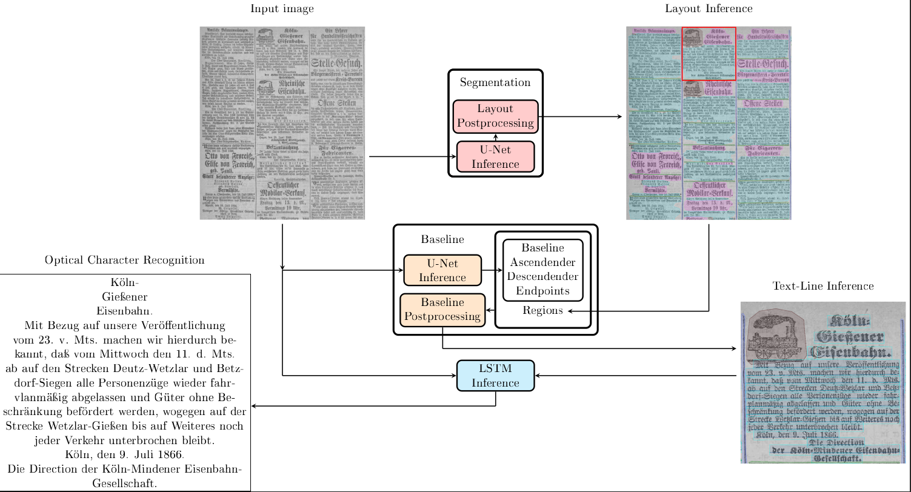

# Chronicling-Germany: A Historic Newspaper Dataset

Code for our paper [Chronicling-Germany](https://arxiv.org/abs/2401.16845).

Our layout recognition model is divided into three subtasks:
1. Layout segmentation
2. Baseline detection
3. Optical character recognition

All tasks are trained and evaluated individually but work together to extract text from a given input document (see Prediction Pipeline).



## Installation
The code has been tested on Python 3.10.
```` bash
git clone https://github.com/Digital-History-Bonn/Chronicling-Germany-Code.git && cd Chronicling-Germany-Code
pip install .
````

## Download
To download our dataset and our model, the download.py script can be used:
```` bash
python script/download.py --all
````
Use `--all` to download the dataset and the models. With --dataset and --models you can download only 
one of both. Use `--dataset-path` and `--model-path` to change the folder where the downloaded files are saved.
Defaults are `data/` and `models/`. When downloading data, the split.json file will also be downloaded to an extra 
folder. It provides a dataset split for the training, `validation and test sets.

## Prediction Pipeline
To run the complete prediction from an input image to an annotation XML with layout and text the `pipeline.sh` script can be used.
As per default, this pipeline needs a conda environment named 'pipeline'.
```` bash
bash scipt/pipeline.sh data/
````

Optionally, the amount of processes and threads, as well as the conda environment name can be specified.
If CUDA with at least one GPU is used, the specified amount of processes will be launched for each GPU, for each process the specified amount of threads will be launched.
This applies to all 3 parts of the pipeline and can lead to a CUDA out of memory error. For running the pipeline 
efficiently on large amount of data these parameters have to be adjusted for each model separately.
```` bash
bash scipt/pipeline.sh data/ 'my_env' 1 1 
````

## Layout Segmentation

An image segmentation model for the detection of structure in historical newspaper pages

Model based on: https://arxiv.org/abs/1804.10371

### Preprocessing and Training

Before starting the training process all data has to be converted.
This command loads xml annotation data and converts it to .npy files.
```` bash
python -m cgprocess.layout_segmentation.convert_xml -a annotations/ -o targets/
```` 

The Training script assumes, that the supplied data folder contains 'targets' and 'images' folders.
```` bash
python -m cgprocess.layout_segmentation.train -e 100 -n experiment_name -b 64 -d data_folder/  -g 4 -w 32
````

If the training process has to be interrupted, training can be continued by executing this command.
```` bash
python -m cgprocess.layout_segmentation.train -e 100 -n experiment_name -b 64 -d data_folder/  -l model_name -ls -g 4 -w 32
````

### Prediction

Prediction takes in images and processes them with a specified model. The image is processed in its entirety. 
This can lead to cuda out of memory errors, if the resolution is too high.

If an output folder is specified, images of the prediction will be saved in that folder. However, this option seriously
increases execution time and should only be used for debugging. If the -e option is active, the xml files will be 
exported to a page folder within the data folder. If there are already xml files, those will be overwritten.

Example for calling the predict script.
```` bash
python -m cgprocess.layout_segmentation.predict -d ../../data/ -m models/model_best.pt -t 0.6 -s 0.5 -e -bt 100````
````

### Evaluation

At the end of each training run, the early stopping result is evaluated. 
For evaluating a model without training it, use -- evaluate.

```` bash
python -m cgprocess.layout_segmentation.train -n evaluate -b 64 -d data_folder/ -l model_name -g 4 -w 32 --evaluate
````

### Uncertainty predict
We added a --uncertainty-predict option to the prediction function to analyze the model's predictions. With this option, the predict
function does not output the prediction. Instead, it outputs the areas of uncertainty of the models. These areas are all 
pixels that have a predicted probability under the given threshold for the ground truth class. 
For this, images and groud truth are required.
```` bash
python -m cgprocess.layout_segmentation.predict -d data_folder/ -o output_folder/ -m path/to/model/ -a dh_segment -s 0.5 --transkribus-export --uncertainty-predict
````

## Baseline detection

Baseline detection is based on the idea of pero: 
O Kodym, M Hradiš: Page Layout Analysis System for Unconstrained Historic Documents. ICDAR, 2021.

### Preprocessing and Training
The trainings script need targets saved as .npz files. The target can be created by with our preprocessing script.
```` bash
python -m cgprocess.baseline_detection.preprocess -i path/to/images -a path/to/annotations -o path/to/output/folder
```` bash
The preprocessed data can then be splited into our train, valid and test split with:
```` bash
python -m cgprocess.baseline_detection.split -i path/to/images -a path/to/targets -o path/to/output/folder
```` bash
The training script can then be started with:
```` bash
python -m cgprocess.baseline_detection.trainer -n NameOfTheModel -t path/to/train/data -v path/to/train/data -e 200
````

### Prediction
The baseline prediction uses the layout (prediction) to differentiate between different text regions and exclude Table regions.
It can be started with:
```` bash
python -m cgprocess.baseline_detection.predict -i path/to/images -l path/to/layout/annotations -o path/to/output/folder -m path/to/model
````
The image folder and the layout folder can be the same, but the name of the image file and the .xml file with the layout annotations must match.

## Optical character recognition
The OCR is based on Kraken (https://kraken.re/main/index.html).

**_NOTE:_**  Kraken uses an older shapely version and is therefore not compatible with our code for layout segmentation and baseline detection. Therefore a separate python enviroment is required for the OCR subtask. The necessary requirements can be found in the reqierements.txt in src/OCR

### Preprocessing and Training
Kraken uses the filename in the .xml file to find the image while training. So the image files should always be in the same folder as the annotation files.
For preprocessing we padded all images and the annotations by 10 pixels. This can be done by:
```` bash
python -m cgprocess.OCR.LSTM.preprocess -i path/to/image/data -a path/to/annotation/data  -o path/to/output/folder
````

After that, the training can be started:
```` bash
python -m cgprocess.OCR.LSTM.train -n NameOfTheModel -t path/to/train/data -v path/to/valid/data
````

### Prediction
To predict the Text in an image our tool needs baseline (predictions). The process can be started with:
```` bash
python -m cgprocess.OCR.LSTM.predict -i path/to/images -l path/to/annotations -o path/to/output/folder -m path/to/model
```` bash
Again, the image folder and the layout annotation folder can be the same, but the name of the image file and the .xml file with the layout annotations must match.


## Code Style
Pylint can be used with PyCharm by installing the Pylint plugin.

My py can be used with PyCharm by installing the MyPy plugin.

## TensorBoard
logs can be accessed through the command line
```` bash
tensorboard --logdir logs/runs
````

or with magic commands in Jupiter notebooks
```` bash
%load_ext tensorboard
%tensorboard --logdir logs/runs
````

## Citation
````
@misc{schultze2024chronicling,
      title={Chronicling Germany: An Annotated Historical Newspaper Dataset}, 
      author={Christian Schultze and Niklas Kerkfeld and Kara Kuebart and Princilia Weber and Moritz Wolter and Felix Selgert},
      year={2024},
      eprint={2401.16845},
      archivePrefix={arXiv},
      primaryClass={cs.DL}
}
````

